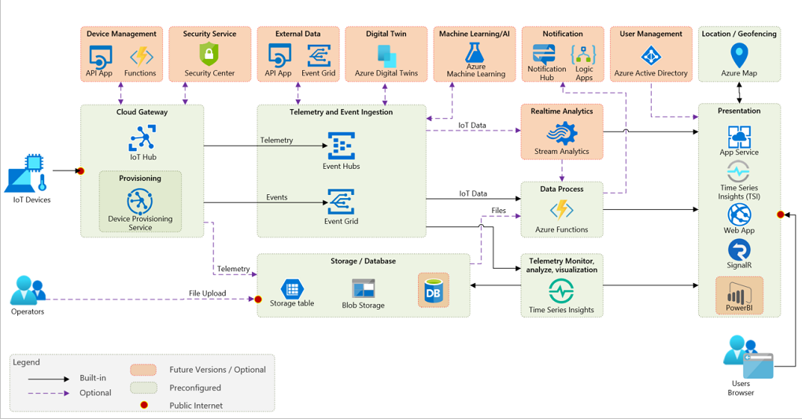

### Open Platform Architectural Diagram

Our [Developer's Guide](Developer-Guide/DeveloperGuide.md) is the resource to double-click into the details on the P15 Open Platform services.

For a quick start guide to deployment, please visit our [Deployment Guide](Deploy/Deployment.md).

## Resources

| Resource Link                                                      | Description                                                                                                                                                                         |
|--------------------------------------------------------------------|:------------------------------------------------------------------------------------------------------------------------------------------------------------------------------------|
| [The Project 15 Channel on YouTube](https://aka.ms/project15video) | A channel that will feature videos highlighting "how to", project spotlights, and other stories about leveraging IoT and AI/ML on Azure for driving conservation and sustainability |
| [AI for Earth](https://aka.ms/aiforearth)                           | Learn about Microsoft's AI for Earth. The array of technical resources available and the grant program.                                                                             |
| [Internet of Things Learning Path](https://aka.ms/iotlp)      | A five module course to learn the concepts of creating a scalable IoT solution on Azure.                                                                                            |
| [Microsoft Learn](https://aka.ms/learn)                             | Microsoft's comprehensive and free learning platform                                                                                                                                |

## FAQs

Coming soon!  

## About The Project 15 Team

The team is actually a big "v-team" (virtual team) that has grown to touch many groups across Microsoft. It would be hard to list all the people that have helped in their weekend hours and spare time internally. It is Microsoft's mission to "Empower every person on the planet to achieve mor (e."  We released this Open Platform in the hopes it would be the bridge between the open source developer community and the scientific community. Accelerating development at a time where we all need to be all hands on deck to fix our Earth.  

This project started about a year and a half ago, it is 9/15/2020 at the time of this writing, as a "what if?" when Sarah had her aha moment that commercial IoT Solutions and devices could help the scientific community. If you ask her, she will tell you about a side conversation with Eric Dinerstein and how she didn't have a clue how to save an Elephant. But she gave him her word that if she could figure out a way to get an "army of nerds" like her to help him and his colleagues, she would.  

We hope you will join us!  

| The Project 15 Principal Team Members                                      | Role                                                                   |
|----------------------------------------------------------------------------|:-----------------------------------------------------------------------|
| [Pamela Cortez](https://www.linkedin.com/in/pamelacortezhellotechie/)      | Architect, Community Lead                                              |
| [Sarah Maston](https://www.linkedin.com/in/smwmaston/)                     | Architect, Product Manager, Co-founder of Project 15                   |
| [Daisuke Nakahara](https://www.linkedin.com/in/daisuke-nakahara-0a997818/) | Lead Architect for Project 15 Open Platform, Co-founder of Project 15  |
| [Anders Zwartjes](https://www.linkedin.com/in/anderszwartjes/)             | Project Stratigist, Marketer, Storyteller                              |                     
| [Lee Stott](https://www.linkedin.com/in/leestott/)                         | Academic Partnerships and Microsoft Learn Student Ambassadors Community|

| The Project 15 Project Sponsors                                   | Role                                                               |
|-------------------------------------------------------------------|:-------------------------------------------------------------------|
| [Rodney Clark](https://www.linkedin.com/in/rodney-clark-4b69b16/) | Corporate Vice President, IoT and Mixed Reality Sales at Microsoft |
| [Analisa Roberts](https://www.linkedin.com/in/analisa-roberts/)   | Senior Director, Azure IoT Marketing at Microsoft                  |

